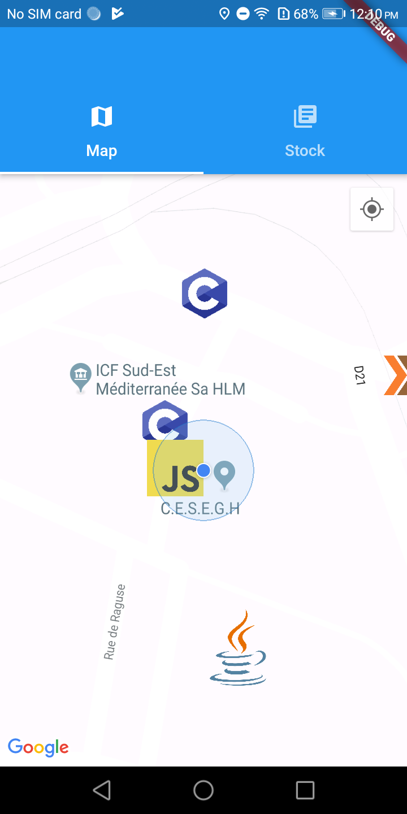

# Kuzzle Go (Flutter demo)

Kuzzle Go is a project made with Kuzzle and Flutter to demonstrate the use of both technologies at the same time.

This project is a go-like application (like *Pokemon Go* or *Harry Potter Wizards Unite*) where you have to catch some programming language.



This source code is related to the [this article]().

## Setup

You have to setup the Google API key for using the Google Map API (used in this project to display a map).

### Manually

For this, you can follow the "Setup" section of [this article](https://medium.com/flutter/google-maps-and-flutter-cfb330f9a245).

### Command line

Just run the following commands (don't forget to replace `PUT_YOUR_API_KEY_HERE` with your API key).

```bash
$ sed -i 's/[[GOOGLE_API_KEY_PLACEHOLDER]]/PUT_YOUR_API_KEY_HERE/g' app/android/app/src/main/AndroidManifest.xml
$ sed -i 's/[[GOOGLE_API_KEY_PLACEHOLDER]]/PUT_YOUR_API_KEY_HERE/g' app/ios/Runner/AppDelegate.m
```

## Run

Run the Kuzzle backend with the following command at the root of this repository:

```bash
$ docker-compose -f server/docker/docker-compose.yml up
```

Run the Flutter app:

```bash
$ cd app && flutter run
```

Let's catch them all!